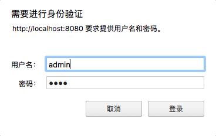
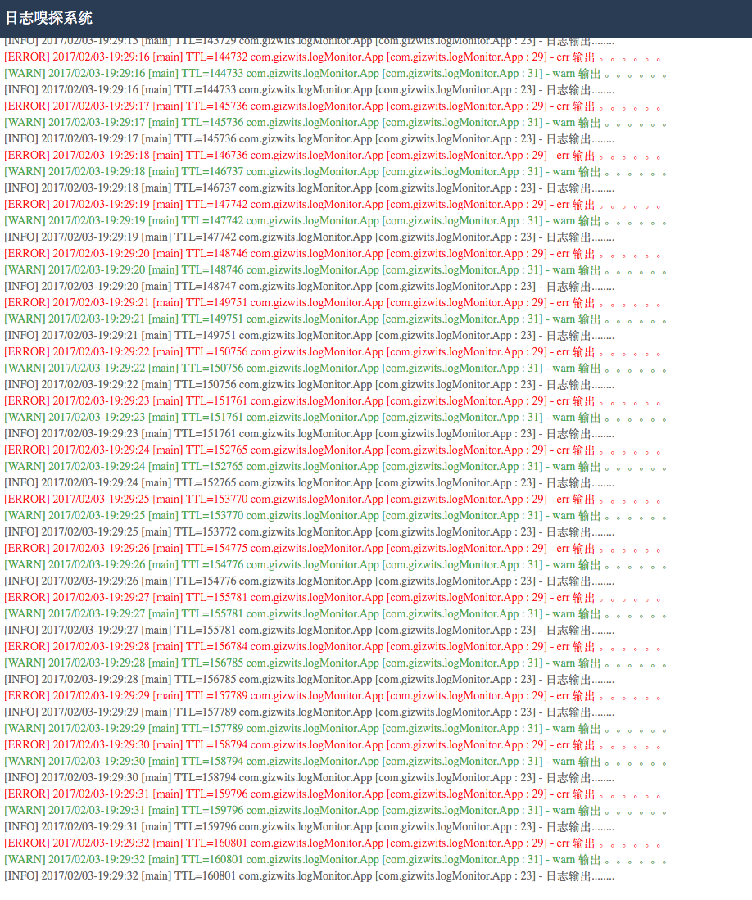

##  日志嗅探系统

### 使用

```
 <dependency>
          <groupId>com.gizwits</groupId>
            <artifactId>LogMonitor</artifactId>
            <version>1.0</version>
        </dependency>
 ```

###  日志及安全配置

```
security.user.name=admin
security.user.password=admin
security.user.role=USER
security.basic.authorize-mode=authenticated
security.enable-csrf=false
logMonitor.logpath=/Users/feel/githome/idea/LogMonitor/logMonitor.log

```
### 在线查看状态
```
 curl -XGET   --insecure --user  admin:admin  http://localhost:8080/logMonitor/status
```
输出
```
 {"code":201,"message":"日志系统嗅探状态：start","ref":"http://localhost:8080"}
```
### 关闭日志系统嗅探

```
  curl -XGET   --insecure --user  admin:admin  http://localhost:8080/logMonitor/set/shutdown
```
输出
```
  {"code":201,"message":"日志系统嗅探关闭成功","ref":"http://localhost:8080"}
```
### 开启日志系统嗅探
```
 curl -XGET   --insecure --user  admin:admin  http://localhost:8080/logMonitor/set/start
```
 输出
 ```
  {"code":201,"message":"日志系统嗅探开启成功","ref":"http://localhost:8080"}
 ```
 
 
 
 
 
 
   
  